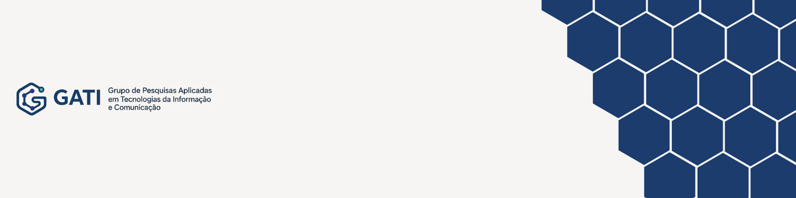

  

## GATI - Grupo de Pesquisas Aplicadas em Tecnologias da Informação e Comunicação

O grupo reúne pesquisadores e estudantes dedicados ao desenvolvimento e aplicação de soluções inovadoras em TIC. Nossas pesquisas abrangem áreas como realidade aumentada e virtual, informática na educação, educação a distância, sistemas web, inteligência artificial e engenharia de software, sempre com foco em impacto social e avanço científico.
